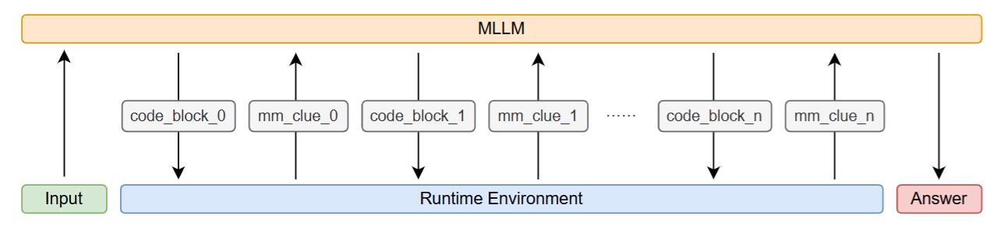
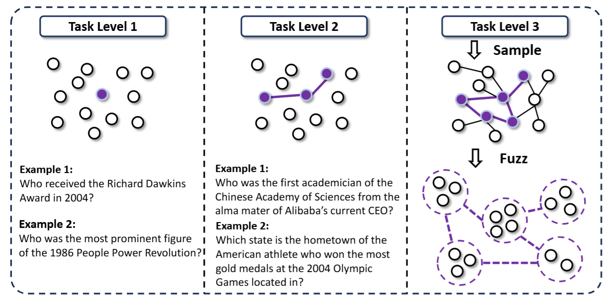
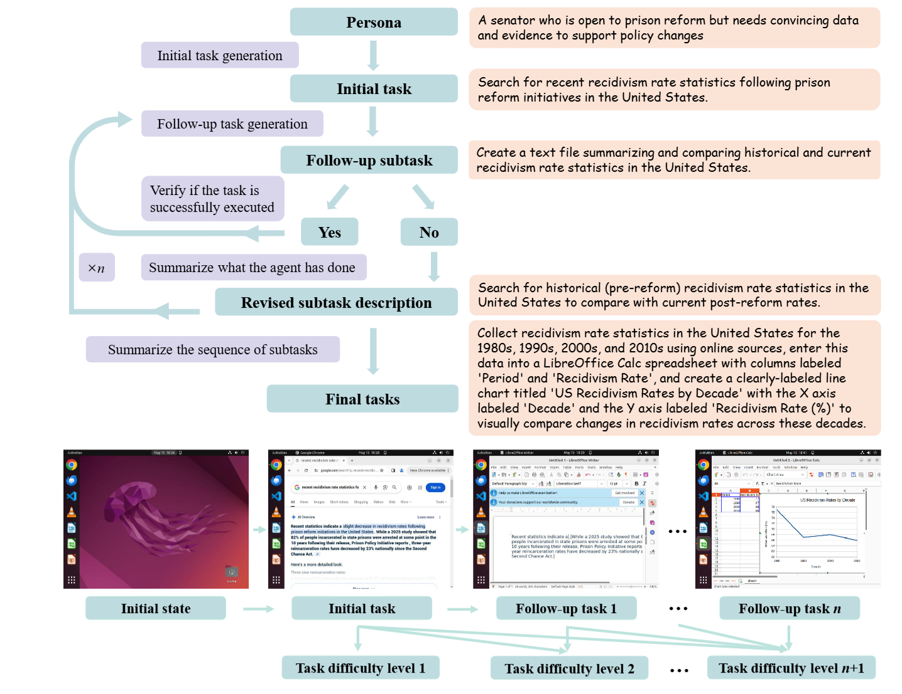

  <h2><b> Awesome-LLM-Agents </b></h2>

## Full list
---

### Quick Links
  - [Agent Tool Use](#agent-tool-use)
    - [Search Tool](#search-tool)
    - [Image Manipulation (Crop/Rotate)](#image-manipulation-croprotate)
    - [Code Tool](#code-tool)
    - [Other Tools](#other-tools)
    - [Dynamic Tool Creation (Sandbox)](#dynamic-tool-creation-sandbox)
  - [GUI Operation](#gui-operation)
  - [Evaluation](#evaluation)
  - [Survey](#survey)
    - [Tool](#tool)
    - [GUI](#gui)
  - [Background](#background)

### Agent Tool Use
| Title & Authors | Introduction | Links |
|:--|  :----: | :---:|
|  [Visual Agentic Reinforcement Fine-Tuning](https://arxiv.org/abs/2505.14246v1)   Ziyu Liu, Yuhang Zang, Yushan Zou, Zijian Liang, Xiaoyi Dong, Yuhang Cao, Haodong Duan, Dahua Lin, Jiaqi Wang | |[Github](https://github.com/Liuziyu77/Visual-RFT)   [Paper](https://arxiv.org/abs/2505.14246v1)| [//]: #07/14
| [OpenThinkIMG: Learning to Think with Images via Visual Tool Reinforcement Learning](https://arxiv.org/abs/2505.08617v2)   Zhaochen Su, Linjie Li, Mingyang Song, Yunzhuo Hao, Zhengyuan Yang, Jun Zhang, Guanjie Chen, Jiawei Gu, Juntao Li, Xiaoye Qu, Yu Cheng | |[Github](https://github.com/zhaochen0110/OpenThinkIMG)   [Paper](https://arxiv.org/abs/2505.08617v2)| [//]: #07/14
| [WebThinker: Empowering Large Reasoning Models with Deep Research Capability](https://arxiv.org/abs/2504.21776)   Xiaoxi Li, Jiajie Jin, Guanting Dong, Hongjin Qian, Yutao Zhu, Yongkang Wu, Ji-Rong Wen, Zhicheng Dou | |[Github](https://github.com/RUC-NLPIR/WebThinker)   [Paper](https://arxiv.org/abs/2504.21776)| [//]: #07/14
| [PyVision: Agentic Vision with Dynamic Tooling](https://arxiv.org/abs/2507.07998)   Shitian Zhao, Haoquan Zhang, Shaoheng Lin, Ming Li, Qilong Wu, Kaipeng Zhang, Chen Wei | |[Github](https://github.com/agents-x-project/PyVision)   [Paper](https://arxiv.org/abs/2507.07998)| [//]: #07/14
| [WebSailor: Navigating Super-human Reasoning for Web Agent](https://arxiv.org/abs/2507.02592)   Kuan Li, Zhongwang Zhang, Huifeng Yin, Liwen Zhang, Litu Ou, Jialong Wu, Wenbiao Yin, Baixuan Li, Zhengwei Tao, Xinyu Wang, Weizhou Shen, Junkai Zhang, Dingchu Zhang, Xixi Wu, Yong Jiang, Ming Yan, Pengjun Xie, Fei Huang, Jingren Zhou | |[Github](https://github.com/Alibaba-NLP/WebAgent)   [Paper](https://arxiv.org/abs/2507.02592)| [//]: #07/14
| [Search-o1: Agentic Search-Enhanced Large Reasoning Models](https://arxiv.org/abs/2501.05366)   Xiaoxi Li, Guanting Dong, Jiajie Jin, Yuyao Zhang, Yujia Zhou, Yutao Zhu, Peitian Zhang, Zhicheng Dou | |[Github](https://github.com/sunnynexus/Search-o1)   [Paper](https://arxiv.org/abs/2501.05366)| [//]: #07/14
| [MMSearch-R1: Incentivizing LMMs to Search](https://arxiv.org/abs/2506.20670)   Jinming Wu, Zihao Deng, Wei Li, Yiding Liu, Bo You, Bo Li, Zejun Ma, Ziwei Liu | |[Github](https://github.com/EvolvingLMMs-Lab/multimodal-search-r1)   [Paper](https://arxiv.org/abs/2506.20670)| [//]: #07/14
| [VideoDeepResearch: Long Video Understanding With Agentic Tool Using](https://arxiv.org/abs/2506.10821)   Huaying Yuan, Zheng Liu, Junjie Zhou, Hongjin Qian, Ji-Rong Wen, Zhicheng Dou | |[Github](https://github.com/yhy-2000/VideoDeepResearch)   [Paper](https://arxiv.org/abs/2506.10821)| [//]: #07/14
#### Benchmark
| Title & Authors | Introduction | Links |
|:--|  :----: | :---:|
|  [MMSearch: Benchmarking the Potential of Large Models as Multi-modal Search Engines](https://arxiv.org/abs/2409.12959v2)   Dongzhi Jiang, Renrui Zhang, Ziyu Guo, Yanmin Wu, Jiayi Lei, Pengshuo Qiu, Pan Lu, Zehui Chen, Chaoyou Fu, Guanglu Song, Peng Gao, Yu Liu, Chunyuan Li, Hongsheng Li | |[Github](https://github.com/CaraJ7/MMSearch)   [Paper](https://arxiv.org/abs/2409.12959v2)| [//]: #07/14
| [Mind2Web 2: Evaluating Agentic Search with Agent-as-a-Judge](https://arxiv.org/abs/2506.21506)   Boyu Gou, Zanming Huang, Yuting Ning, Yu Gu, Michael Lin, Weijian Qi, Andrei Kopanev, Botao Yu, Bernal Jiménez Gutiérrez, Yiheng Shu, Chan Hee Song, Jiaman Wu, Shijie Chen, Hanane Nour Moussa, Tianshu Zhang, Jian Xie, Yifei Li, Tianci Xue, Zeyi Liao, Kai Zhang, Boyuan Zheng, Zhaowei Cai, Viktor Rozgic, Morteza Ziyadi, Huan Sun, Yu Su | |[Github](https://github.com/osu-nlp-group/mind2web2)   [Paper](https://arxiv.org/abs/2506.21506)| [//]: #07/14

#### Search Tool

#### Image Manipulation (Crop/Rotate)

#### Code Tool

#### Other Tools

#### Dynamic Tool Creation (Sandbox)

### GUI Operation
| Title & Authors | Introduction | Links |
|:--|  :----: | :---:|
| [GTA1: GUI Test-time Scaling Agent](https://www.arxiv.org/abs/2507.05791)   Yan Yang, Dongxu Li, Yutong Dai, Yuhao Yang, Ziyang Luo, Zirui Zhao, Zhiyuan Hu, Junzhe Huang, Amrita Saha, Zeyuan Chen, Ran Xu, Liyuan Pan, Caiming Xiong, Junnan Li | |[Github](https://github.com/Yan98/GTA1)   [Paper](https://www.arxiv.org/abs/2507.05791)| [//]: #07/13
|  [ShowUI: One Vision-Language-Action Model for GUI Visual Agent](https://arxiv.org/abs/2411.17465)   Kevin Qinghong Lin, Linjie Li, Difei Gao, Zhengyuan Yang, Shiwei Wu, Zechen Bai, Weixian Lei, Lijuan Wang, Mike Zheng Shou | |[Github](https://github.com/showlab/ShowUI)   [Paper](https://arxiv.org/abs/2411.17465)| [//]: #07/13
|  [AppAgent: Multimodal Agents as Smartphone Users](https://arxiv.org/abs/2312.13771)   Chi Zhang, Zhao Yang, Jiaxuan Liu, Yucheng Han, Xin Chen, Zebiao Huang, Bin Fu, Gang Yu | |[Github](https://github.com/TencentQQGYLab/AppAgent)   [Paper](https://arxiv.org/abs/2312.13771)| [//]: #07/13
| [Mirage-1: Augmenting and Updating GUI Agent with Hierarchical Multimodal Skills](https://arxiv.org/abs/2506.10387)   Yuquan Xie, Zaijing Li, Rui Shao, Gongwei Chen, Kaiwen Zhou, Yinchuan Li, Dongmei Jiang, Liqiang Nie | |[Github](https://github.com/JiuTian-VL/Mirage-1)   [Paper](https://arxiv.org/abs/2506.10387)| [//]: #07/13
| [AgentSynth: Scalable Task Generation for Generalist Computer-Use Agents](https://arxiv.org/abs/2506.14205)   Jingxu Xie, Dylan Xu, Xuandong Zhao, Dawn Song | |[Github](https://github.com/sunblaze-ucb/AgentSynth)   [Paper](https://arxiv.org/abs/2506.14205)| [//]: #07/13
| [Look Before You Leap: A GUI-Critic-R1 Model for Pre-Operative Error Diagnosis in GUI Automation](https://arxiv.org/abs/2506.04614)   Yuyang Wanyan, Xi Zhang, Haiyang Xu, Haowei Liu, Junyang Wang, Jiabo Ye, Yutong Kou, Ming Yan, Fei Huang, Xiaoshan Yang, Weiming Dong, Changsheng Xu | |[Github](https://github.com/X-PLUG/MobileAgent)   [Paper](https://arxiv.org/abs/2506.04614)| [//]: #07/13
| [GUI-Reflection: Empowering Multimodal GUI Models with Self-Reflection Behavior](https://arxiv.org/abs/2506.08012)   Penghao Wu, Shengnan Ma, Bo Wang, Jiaheng Yu, Lewei Lu, Ziwei Liu | |[Github](https://github.com/penghao-wu/GUI_Reflection)   [Paper](https://arxiv.org/abs/2506.08012)| [//]: #07/13
### Evaluation

### Survey
#### Tool
| Title & Authors | Introduction | Links |
|:--|  :----: | :---:|
|  [Vision-Language Models for Vision Tasks: A Survey](https://arxiv.org/abs/2304.00685)   Jingyi Zhang, Jiaxing Huang, Sheng Jin, Shijian Lu | |[Github](https://github.com/jingyi0000/VLM_survey)   [Paper](https://arxiv.org/abs/2304.00685)| [//]: #07/14
|  [Tool Learning with Large Language Models: A Survey](https://arxiv.org/abs/2405.17935v1)   Changle Qu, Sunhao Dai, Xiaochi Wei, Hengyi Cai, Shuaiqiang Wang, Dawei Yin, Jun Xu, Ji-Rong Wen | |[Github](https://github.com/quchangle1/LLM-Tool-Survey)   [Paper](https://arxiv.org/abs/2405.17935v1)| [//]: #07/14
|[What Are Tools Anyway? A Survey from the Language Model Perspective](https://arxiv.org/abs/2403.15452)   Zhiruo Wang, Zhoujun Cheng, Hao Zhu, Daniel Fried, Graham Neubig | |[Paper](https://arxiv.org/abs/2403.15452)| [//]: #07/14
#### GUI
| Title & Authors | Introduction | Links |
|:--|  :----: | :---:|
|[GUI Agents with Foundation Models: A Comprehensive Survey](https://arxiv.org/abs/2411.04890)   Shuai Wang, Weiwen Liu, Jingxuan Chen, Yuqi Zhou, Weinan Gan, Xingshan Zeng, Yuhan Che, Shuai Yu, Xinlong Hao, Kun Shao, Bin Wang, Chuhan Wu, Yasheng Wang, Ruiming Tang, Jianye Hao | |[Paper](https://arxiv.org/abs/2411.04890)| [//]: #07/14
### Background

## Acknowledgement

This repository is inspired by [Awesome-Efficient-LLM](https://github.com/horseee/Awesome-Efficient-LLM/) and [Awesome-Efficient-Reasoning-Models
](https://github.com/fscdc/Awesome-Efficient-Reasoning-Models)