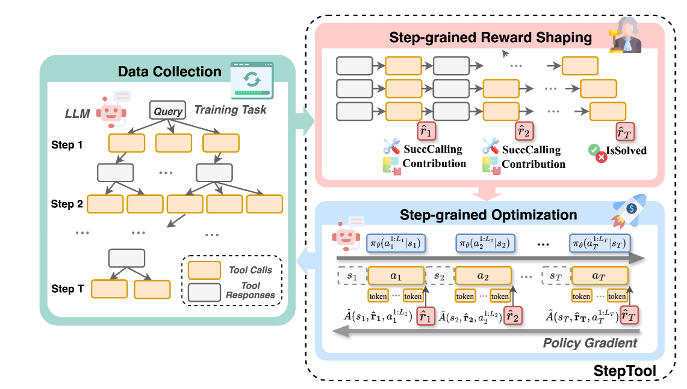

  <h2><b> Awesome-LLM-Agents </b></h2>

  
  
  

## Full list

### Quick Links
  - [Agent Tool Use](#agent-tool-use)
  - [GUI Operation](#gui-operation)
  - [Data Generation for Agent Training](#data-generation-for-agent-training)
  - [Evaluation](#evaluation)
  - [Dataset](#dataset)
  - [Survey](#survey)
    - [Background](#background)
    - [Tool](#tool)
    - [GUI](#gui)
  - [Background](#background)
  - [Domain-Specific Agents](#domain-specific-agents)

### Agent Tool Use
| Title & Authors | Introduction | Links |
|:--|  :----: | :---:|
| [MCP-Zero: Active Tool Discovery for Autonomous LLM Agents](https://arxiv.org/abs/2506.01056)   Xiang Fei, Xiawu Zheng, Hao Feng | |[Github](https://github.com/xfey/MCP-Zero)   [Paper](https://arxiv.org/abs/2506.01056)| [//]: #07/17
|[ToolNet: Connecting Large Language Models with Massive Tools via Tool Graph](https://arxiv.org/abs/2403.00839)   Xukun Liu, Zhiyuan Peng, Xiaoyuan Yi, Xing Xie, Lirong Xiang, Yuchen Liu, Dongkuan Xu | |[Paper](https://arxiv.org/abs/2403.00839)| [//]: #07/17
| [Iterative Tool Usage Exploration for Multimodal Agents via Step-wise Preference Tuning](https://arxiv.org/abs/2504.21561)   Pengxiang Li, Zhi Gao, Bofei Zhang, Yapeng Mi, Xiaojian Ma, Chenrui Shi, Tao Yuan, Yuwei Wu, Yunde Jia, Song-Chun Zhu, Qing Li | |[Github](https://github.com/SPORT-Agents/SPORT-Agents)   [Paper](https://arxiv.org/abs/2504.21561)| [//]: #07/17
| [Nemotron-Research-Tool-N1: Exploring Tool-Using Language Models with Reinforced Reasoning](https://arxiv.org/abs/2505.00024)   Shaokun Zhang, Yi Dong, Jieyu Zhang, Jan Kautz, Bryan Catanzaro, Andrew Tao, Qingyun Wu, Zhiding Yu, Guilin Liu | |[Github](https://github.com/NVlabs/Tool-N1)   [Paper](https://arxiv.org/abs/2505.00024)| [//]: #07/17
|  [StepTool: Enhancing Multi-Step Tool Usage in LLMs through Step-Grained Reinforcement Learning](https://arxiv.org/abs/2410.07745)   Yuanqing Yu, Zhefan Wang, Weizhi Ma, Shuai Wang, Chuhan Wu, Zhiqiang Guo, Min Zhang | |[Paper](https://arxiv.org/abs/2410.07745)| [//]: #07/17
|[OTC: Optimal Tool Calls via Reinforcement Learning](https://arxiv.org/abs/2504.14870v1)   Hongru Wang, Cheng Qian, Wanjun Zhong, Xiusi Chen, Jiahao Qiu, Shijue Huang, Bowen Jin, Mengdi Wang, Kam-Fai Wong, Heng Ji | |[Paper](https://arxiv.org/abs/2504.14870v1)| [//]: #07/16
| [SciMaster: Towards General-Purpose Scientific AI Agents, Part I. X-Master as Foundation: Can We Lead on Humanity's Last Exam?](https://arxiv.org/abs/2507.05241v2)   Jingyi Chai, Shuo Tang, Rui Ye, Yuwen Du, Xinyu Zhu, Mengcheng Zhou, Yanfeng Wang, Weinan E, Yuzhi Zhang, Linfeng Zhang, Siheng Chen | |[Github](https://github.com/sjtu-sai-agents/X-Master)   [Paper](https://arxiv.org/abs/2507.05241v2)| [//]: #07/14
|  [Visual Agentic Reinforcement Fine-Tuning](https://arxiv.org/abs/2505.14246v1)   Ziyu Liu, Yuhang Zang, Yushan Zou, Zijian Liang, Xiaoyi Dong, Yuhang Cao, Haodong Duan, Dahua Lin, Jiaqi Wang | |[Github](https://github.com/Liuziyu77/Visual-RFT)   [Paper](https://arxiv.org/abs/2505.14246v1)| [//]: #07/14
| [OpenThinkIMG: Learning to Think with Images via Visual Tool Reinforcement Learning](https://arxiv.org/abs/2505.08617v2)   Zhaochen Su, Linjie Li, Mingyang Song, Yunzhuo Hao, Zhengyuan Yang, Jun Zhang, Guanjie Chen, Jiawei Gu, Juntao Li, Xiaoye Qu, Yu Cheng | |[Github](https://github.com/zhaochen0110/OpenThinkIMG)   [Paper](https://arxiv.org/abs/2505.08617v2)| [//]: #07/14
| [WebThinker: Empowering Large Reasoning Models with Deep Research Capability](https://arxiv.org/abs/2504.21776)   Xiaoxi Li, Jiajie Jin, Guanting Dong, Hongjin Qian, Yutao Zhu, Yongkang Wu, Ji-Rong Wen, Zhicheng Dou | |[Github](https://github.com/RUC-NLPIR/WebThinker)   [Paper](https://arxiv.org/abs/2504.21776)| [//]: #07/14
| [PyVision: Agentic Vision with Dynamic Tooling](https://arxiv.org/abs/2507.07998)   Shitian Zhao, Haoquan Zhang, Shaoheng Lin, Ming Li, Qilong Wu, Kaipeng Zhang, Chen Wei | |[Github](https://github.com/agents-x-project/PyVision)   [Paper](https://arxiv.org/abs/2507.07998)| [//]: #07/14
| [WebSailor: Navigating Super-human Reasoning for Web Agent](https://arxiv.org/abs/2507.02592)   Kuan Li, Zhongwang Zhang, Huifeng Yin, Liwen Zhang, Litu Ou, Jialong Wu, Wenbiao Yin, Baixuan Li, Zhengwei Tao, Xinyu Wang, Weizhou Shen, Junkai Zhang, Dingchu Zhang, Xixi Wu, Yong Jiang, Ming Yan, Pengjun Xie, Fei Huang, Jingren Zhou | |[Github](https://github.com/Alibaba-NLP/WebAgent)   [Paper](https://arxiv.org/abs/2507.02592)| [//]: #07/14
| [Search-o1: Agentic Search-Enhanced Large Reasoning Models](https://arxiv.org/abs/2501.05366)   Xiaoxi Li, Guanting Dong, Jiajie Jin, Yuyao Zhang, Yujia Zhou, Yutao Zhu, Peitian Zhang, Zhicheng Dou | |[Github](https://github.com/sunnynexus/Search-o1)   [Paper](https://arxiv.org/abs/2501.05366)| [//]: #07/14
| [MMSearch-R1: Incentivizing LMMs to Search](https://arxiv.org/abs/2506.20670)   Jinming Wu, Zihao Deng, Wei Li, Yiding Liu, Bo You, Bo Li, Zejun Ma, Ziwei Liu | |[Github](https://github.com/EvolvingLMMs-Lab/multimodal-search-r1)   [Paper](https://arxiv.org/abs/2506.20670)| [//]: #07/14
| [VideoDeepResearch: Long Video Understanding With Agentic Tool Using](https://arxiv.org/abs/2506.10821)   Huaying Yuan, Zheng Liu, Junjie Zhou, Hongjin Qian, Ji-Rong Wen, Zhicheng Dou | |[Github](https://github.com/yhy-2000/VideoDeepResearch)   [Paper](https://arxiv.org/abs/2506.10821)| [//]: #07/14
### GUI Operation
| Title & Authors | Introduction | Links |
|:--|  :----: | :---:|
| [GUI-Actor: Coordinate-Free Visual Grounding for GUI Agents](https://arxiv.org/abs/2506.03143)   Qianhui Wu, Kanzhi Cheng, Rui Yang, Chaoyun Zhang, Jianwei Yang, Huiqiang Jiang, Jian Mu, Baolin Peng, Bo Qiao, Reuben Tan, Si Qin, Lars Liden, Qingwei Lin, Huan Zhang, Tong Zhang, Jianbing Zhang, Dongmei Zhang, Jianfeng Gao | |[Github](https://github.com/microsoft/GUI-Actor)   [Paper](https://arxiv.org/abs/2506.03143)| [//]: #07/17
| [GTA1: GUI Test-time Scaling Agent](https://www.arxiv.org/abs/2507.05791)   Yan Yang, Dongxu Li, Yutong Dai, Yuhao Yang, Ziyang Luo, Zirui Zhao, Zhiyuan Hu, Junzhe Huang, Amrita Saha, Zeyuan Chen, Ran Xu, Liyuan Pan, Caiming Xiong, Junnan Li | |[Github](https://github.com/Yan98/GTA1)   [Paper](https://www.arxiv.org/abs/2507.05791)| [//]: #07/13
|  [ShowUI: One Vision-Language-Action Model for GUI Visual Agent](https://arxiv.org/abs/2411.17465)   Kevin Qinghong Lin, Linjie Li, Difei Gao, Zhengyuan Yang, Shiwei Wu, Zechen Bai, Weixian Lei, Lijuan Wang, Mike Zheng Shou | |[Github](https://github.com/showlab/ShowUI)   [Paper](https://arxiv.org/abs/2411.17465)| [//]: #07/13
|  [AppAgent: Multimodal Agents as Smartphone Users](https://arxiv.org/abs/2312.13771)   Chi Zhang, Zhao Yang, Jiaxuan Liu, Yucheng Han, Xin Chen, Zebiao Huang, Bin Fu, Gang Yu | |[Github](https://github.com/TencentQQGYLab/AppAgent)   [Paper](https://arxiv.org/abs/2312.13771)| [//]: #07/13
| [Mirage-1: Augmenting and Updating GUI Agent with Hierarchical Multimodal Skills](https://arxiv.org/abs/2506.10387)   Yuquan Xie, Zaijing Li, Rui Shao, Gongwei Chen, Kaiwen Zhou, Yinchuan Li, Dongmei Jiang, Liqiang Nie | |[Github](https://github.com/JiuTian-VL/Mirage-1)   [Paper](https://arxiv.org/abs/2506.10387)| [//]: #07/13
| [Look Before You Leap: A GUI-Critic-R1 Model for Pre-Operative Error Diagnosis in GUI Automation](https://arxiv.org/abs/2506.04614)   Yuyang Wanyan, Xi Zhang, Haiyang Xu, Haowei Liu, Junyang Wang, Jiabo Ye, Yutong Kou, Ming Yan, Fei Huang, Xiaoshan Yang, Weiming Dong, Changsheng Xu | |[Github](https://github.com/X-PLUG/MobileAgent)   [Paper](https://arxiv.org/abs/2506.04614)| [//]: #07/13
| [GUI-Reflection: Empowering Multimodal GUI Models with Self-Reflection Behavior](https://arxiv.org/abs/2506.08012)   Penghao Wu, Shengnan Ma, Bo Wang, Jiaheng Yu, Lewei Lu, Ziwei Liu | |[Github](https://github.com/penghao-wu/GUI_Reflection)   [Paper](https://arxiv.org/abs/2506.08012)| [//]: #07/13
### Data Generation for Agent Training
| Title & Authors | Introduction | Links |
|:--|  :----: | :---:|
| [TaskCraft: Automated Generation of Agentic Tasks](https://arxiv.org/abs/2506.10055)   Dingfeng Shi, Jingyi Cao, Qianben Chen, Weichen Sun, Weizhen Li, Hongxuan Lu, Fangchen Dong, Tianrui Qin, King Zhu, Minghao Liu, Jian Yang, Ge Zhang, Jiaheng Liu, Changwang Zhang, Jun Wang, Yuchen Eleanor Jiang, Wangchunshu Zhou | |[Github](https://github.com/OPPO-PersonalAI/TaskCraft)   [Paper](https://arxiv.org/abs/2506.10055)| [//]: #07/14
| [AgentSynth: Scalable Task Generation for Generalist Computer-Use Agents](https://arxiv.org/abs/2506.14205)   Jingxu Xie, Dylan Xu, Xuandong Zhao, Dawn Song | |[Github](https://github.com/sunblaze-ucb/AgentSynth)   [Paper](https://arxiv.org/abs/2506.14205)| [//]: #07/13
### Evaluation
| Title & Authors | Introduction | Links |
|:--|  :----: | :---:|
| [WebArena: A Realistic Web Environment for Building Autonomous Agents](https://arxiv.org/abs/2307.13854)   Shuyan Zhou, Frank F. Xu, Hao Zhu, Xuhui Zhou, Robert Lo, Abishek Sridhar, Xianyi Cheng, Tianyue Ou, Yonatan Bisk, Daniel Fried, Uri Alon, Graham Neubig | |[Github](https://github.com/web-arena-x/webarena)   [Paper](https://arxiv.org/abs/2307.13854)| [//]: #07/18
| [BrowseComp: A Simple Yet Challenging Benchmark for Browsing Agents](https://arxiv.org/abs/2504.12516)   Jason Wei, Zhiqing Sun, Spencer Papay, Scott McKinney, Jeffrey Han, Isa Fulford, Hyung Won Chung, Alex Tachard Passos, William Fedus, Amelia Glaese | |[Github](https://github.com/openai/simple-evals)   [Paper](https://arxiv.org/abs/2504.12516)| [//]: #07/18
|  [SpreadsheetBench: Towards Challenging Real World Spreadsheet Manipulation](https://arxiv.org/abs/2406.14991)   Zeyao Ma, Bohan Zhang, Jing Zhang, Jifan Yu, Xiaokang Zhang, Xiaohan Zhang, Sijia Luo, Xi Wang, Jie Tang | |[Github](https://github.com/RUCKBReasoning/SpreadsheetBench)   [Paper](https://arxiv.org/abs/2406.14991)| [//]: #07/18
| [τ-bench: A Benchmark for Tool-Agent-User Interaction in Real-World Domains](https://arxiv.org/abs/2406.12045)   Shunyu Yao, Noah Shinn, Pedram Razavi, Karthik Narasimhan | |[Github](https://github.com/sierra-research/tau-bench)   [Paper](https://arxiv.org/abs/2406.12045)| [//]: #07/17
|  [GTA: A Benchmark for General Tool Agents](https://arxiv.org/abs/2407.08713)   Jize Wang, Zerun Ma, Yining Li, Songyang Zhang, Cailian Chen, Kai Chen, Xinyi Le | |[Github](https://github.com/open-compass/GTA)   [Paper](https://arxiv.org/abs/2407.08713)| [//]: #07/17
|[ACEBench: Who Wins the Match Point in Tool Usage?](https://arxiv.org/abs/2501.12851)   Chen Chen, Xinlong Hao, Weiwen Liu, Xu Huang, Xingshan Zeng, Shuai Yu, Dexun Li, Shuai Wang, Weinan Gan, Yuefeng Huang, Wulong Liu, Xinzhi Wang, Defu Lian, Baoqun Yin, Yasheng Wang, Wu Liu | |[Paper](https://arxiv.org/abs/2501.12851)| [//]: #07/17
|  [MMSearch: Benchmarking the Potential of Large Models as Multi-modal Search Engines](https://arxiv.org/abs/2409.12959v2)   Dongzhi Jiang, Renrui Zhang, Ziyu Guo, Yanmin Wu, Jiayi Lei, Pengshuo Qiu, Pan Lu, Zehui Chen, Chaoyou Fu, Guanglu Song, Peng Gao, Yu Liu, Chunyuan Li, Hongsheng Li | |[Github](https://github.com/CaraJ7/MMSearch)   [Paper](https://arxiv.org/abs/2409.12959v2)| [//]: #07/14
| [Mind2Web 2: Evaluating Agentic Search with Agent-as-a-Judge](https://arxiv.org/abs/2506.21506)   Boyu Gou, Zanming Huang, Yuting Ning, Yu Gu, Michael Lin, Weijian Qi, Andrei Kopanev, Botao Yu, Bernal Jiménez Gutiérrez, Yiheng Shu, Chan Hee Song, Jiaman Wu, Shijie Chen, Hanane Nour Moussa, Tianshu Zhang, Jian Xie, Yifei Li, Tianci Xue, Zeyi Liao, Kai Zhang, Boyuan Zheng, Zhaowei Cai, Viktor Rozgic, Morteza Ziyadi, Huan Sun, Yu Su | |[Github](https://github.com/osu-nlp-group/mind2web2)   [Paper](https://arxiv.org/abs/2506.21506)| [//]: #07/14
|  [Agent-as-a-Judge: Evaluate Agents with Agents](https://arxiv.org/abs/2410.10934)   Mingchen Zhuge, Changsheng Zhao, Dylan Ashley, Wenyi Wang, Dmitrii Khizbullin, Yunyang Xiong, Zechun Liu, Ernie Chang, Raghuraman Krishnamoorthi, Yuandong Tian, Yangyang Shi, Vikas Chandra, Jürgen Schmidhuber | |[Github](https://github.com/metauto-ai/agent-as-a-judge)   [Paper](https://arxiv.org/abs/2410.10934)| [//]: #07/14
### Dataset
| Title & Authors | Introduction | Links |
|:--|  :----: | :---:|
| [Search Arena: Analyzing Search-Augmented LLMs](https://arxiv.org/abs/2506.05334)   Mihran Miroyan, Tsung-Han Wu, Logan King, Tianle Li, Jiayi Pan, Xinyan Hu, Wei-Lin Chiang, Anastasios N. Angelopoulos, Trevor Darrell, Narges Norouzi, Joseph E. Gonzalez | |[Github](https://github.com/lmarena/search-arena)   [Paper](https://arxiv.org/abs/2506.05334)| [//]: #07/17
### Survey
#### Background
| Title & Authors | Introduction | Links |
|:--|  :----: | :---:|
|[Agentic Large Language Models, a survey](https://arxiv.org/abs/2503.23037)   Aske Plaat, Max van Duijn, Niki van Stein, Mike Preuss, Peter van der Putten, Kees Joost Batenburg | |[Paper](https://arxiv.org/abs/2503.23037)| [//]: #07/19
|[A Survey on Large Language Model based Autonomous Agents](https://arxiv.org/abs/2308.11432)   Lei Wang, Chen Ma, Xueyang Feng, Zeyu Zhang, Hao Yang, Jingsen Zhang, Zhiyuan Chen, Jiakai Tang, Xu Chen, Yankai Lin, Wayne Xin Zhao, Zhewei Wei, Ji-Rong Wen | |[Paper](https://arxiv.org/abs/2308.11432)| [//]: #07/17
#### Tool
| Title & Authors | Introduction | Links |
|:--|  :----: | :---:|
|  [Vision-Language Models for Vision Tasks: A Survey](https://arxiv.org/abs/2304.00685)   Jingyi Zhang, Jiaxing Huang, Sheng Jin, Shijian Lu | |[Github](https://github.com/jingyi0000/VLM_survey)   [Paper](https://arxiv.org/abs/2304.00685)| [//]: #07/14
|  [Tool Learning with Large Language Models: A Survey](https://arxiv.org/abs/2405.17935v1)   Changle Qu, Sunhao Dai, Xiaochi Wei, Hengyi Cai, Shuaiqiang Wang, Dawei Yin, Jun Xu, Ji-Rong Wen | |[Github](https://github.com/quchangle1/LLM-Tool-Survey)   [Paper](https://arxiv.org/abs/2405.17935v1)| [//]: #07/14
|[What Are Tools Anyway? A Survey from the Language Model Perspective](https://arxiv.org/abs/2403.15452)   Zhiruo Wang, Zhoujun Cheng, Hao Zhu, Daniel Fried, Graham Neubig | |[Paper](https://arxiv.org/abs/2403.15452)| [//]: #07/14
#### GUI
| Title & Authors | Introduction | Links |
|:--|  :----: | :---:|
| [Large Language Model-Brained GUI Agents: A Survey](https://arxiv.org/abs/2411.18279)   Chaoyun Zhang, Shilin He, Jiaxu Qian, Bowen Li, Liqun Li, Si Qin, Yu Kang, Minghua Ma, Guyue Liu, Qingwei Lin, Saravan Rajmohan, Dongmei Zhang, Qi Zhang | |[Github](https://github.com/vyokky/LLM-Brained-GUI-Agents-Survey)   [Paper](https://arxiv.org/abs/2411.18279)| [//]: #07/17
| [A Survey on (M)LLM-Based GUI Agents](https://arxiv.org/abs/2504.13865)   Fei Tang, Haolei Xu, Hang Zhang, Siqi Chen, Xingyu Wu, Yongliang Shen, Wenqi Zhang, Guiyang Hou, Zeqi Tan, Yuchen Yan, Kaitao Song, Jian Shao, Weiming Lu, Jun Xiao, Yueting Zhuang | |[Github](https://github.com/zju-real/Awesome-GUI-Agents)   [Paper](https://arxiv.org/abs/2504.13865)| [//]: #07/19
|[GUI Agents with Foundation Models: A Comprehensive Survey](https://arxiv.org/abs/2411.04890)   Shuai Wang, Weiwen Liu, Jingxuan Chen, Yuqi Zhou, Weinan Gan, Xingshan Zeng, Yuhan Che, Shuai Yu, Xinlong Hao, Kun Shao, Bin Wang, Chuhan Wu, Yasheng Wang, Ruiming Tang, Jianye Hao | |[Paper](https://arxiv.org/abs/2411.04890)| [//]: #07/14
### Background
| Title & Authors | Introduction | Links |
|:--|  :----: | :---:|
|  [Agents Thinking Fast and Slow: A Talker-Reasoner Architecture](https://arxiv.org/abs/2410.08328)   Konstantina Christakopoulou, Shibl Mourad, Maja Matarić | |[Paper](https://arxiv.org/abs/2410.08328)| [//]: #07/17
| [Agent KB: Leveraging Cross-Domain Experience for Agentic Problem Solving](https://arxiv.org/abs/2507.06229)   Xiangru Tang, Tianrui Qin, Tianhao Peng, Ziyang Zhou, Daniel Shao, Tingting Du, Xinming Wei, Peng Xia, Fang Wu, He Zhu, Ge Zhang, Jiaheng Liu, Xingyao Wang, Sirui Hong, Chenglin Wu, Hao Cheng, Chi Wang, Wangchunshu Zhou | |[Github](https://github.com/OPPO-PersonalAI/Agent-KB)   [Paper](https://arxiv.org/abs/2507.06229)| [//]: #07/14
### Domain-Specific Agents
| Title & Authors | Introduction | Links |
|:--|  :----: | :---:|
|[QUITE: A Query Rewrite System Beyond Rules with LLM Agents](https://arxiv.org/abs/2506.07675)   Yuyang Song, Hanxu Yan, Jiale Lao, Yibo Wang, Yufei Li, Yuanchun Zhou, Jianguo Wang, Mingjie Tang | |[Paper](https://arxiv.org/abs/2506.07675)| [//]: #07/14
| [PresentAgent: Multimodal Agent for Presentation Video Generation](https://www.arxiv.org/abs/2507.04036)   Jingwei Shi, Zeyu Zhang, Biao Wu, Yanjie Liang, Meng Fang, Ling Chen, Yang Zhao | |[Github](https://github.com/AIGeeksGroup/PresentAgent)   [Paper](https://www.arxiv.org/abs/2507.04036)| [//]: #07/14
| [AutoMind: Adaptive Knowledgeable Agent for Automated Data Science](https://arxiv.org/abs/2506.10974)   Yixin Ou, Yujie Luo, Jingsheng Zheng, Lanning Wei, Shuofei Qiao, Jintian Zhang, Da Zheng, Huajun Chen, Ningyu Zhang | |[Github](https://github.com/innovatingAI/AutoMind)   [Paper](https://arxiv.org/abs/2506.10974)| [//]: #07/14

## Acknowledgement
This repository is inspired by [Awesome-Efficient-LLM](https://github.com/horseee/Awesome-Efficient-LLM/) and [Awesome-Efficient-Reasoning-Models
](https://github.com/fscdc/Awesome-Efficient-Reasoning-Models)